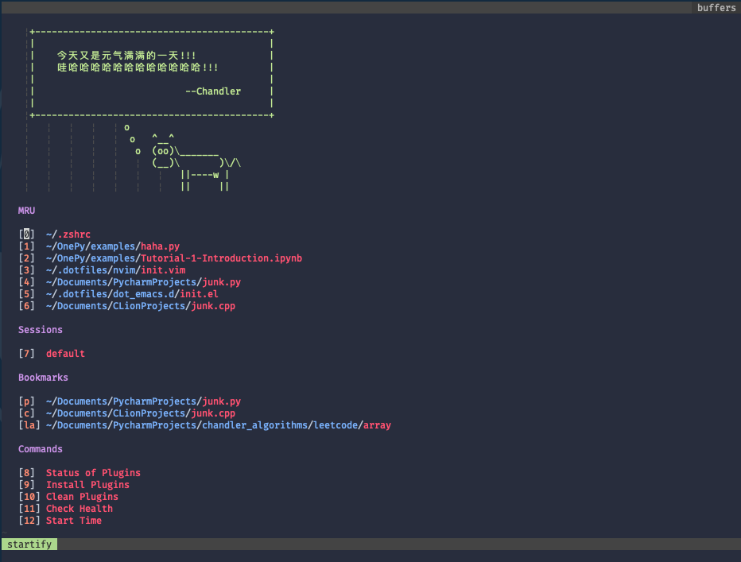
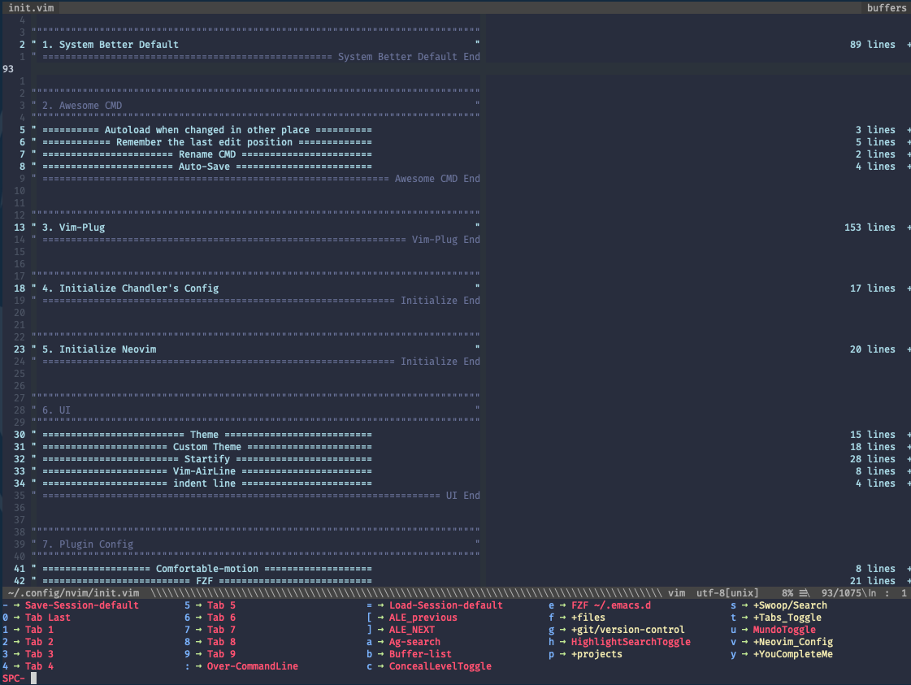

# Chandler's dotfiles

## nvim

- Configuration for **Neovim**.
- All Keybindings are combined in
  [vim-which-key](https://github.com/liuchengxu/vim-which-key) just like
  [SpaceVim](https://github.com/SpaceVim/SpaceVim)
- Lazy load all most of plugin, minimize startup time less than **85ms**.
- You can customize configuration in customize.vim

## dot_emacs.d

- Configuration for **Emacs**.
- Haven't finished.

## dot_terminfo

- A script to add support for 24 bit colour terminals
